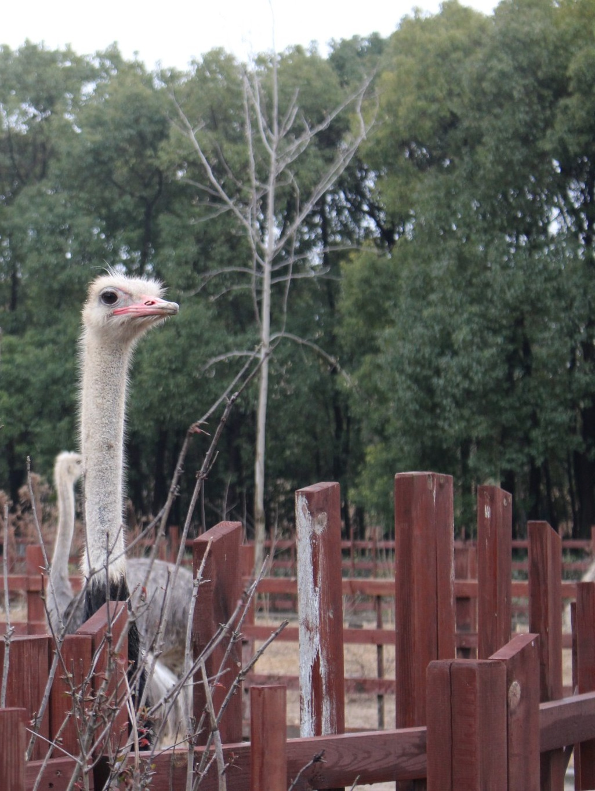
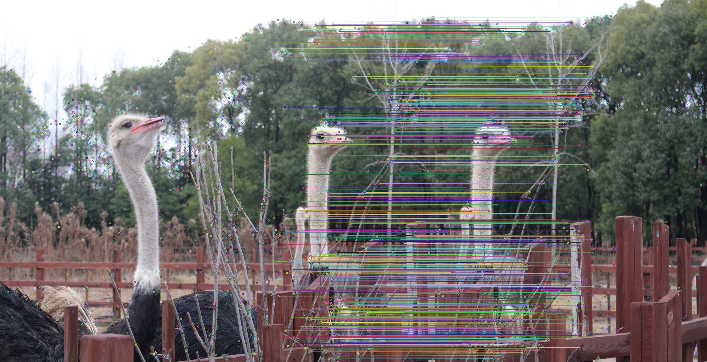
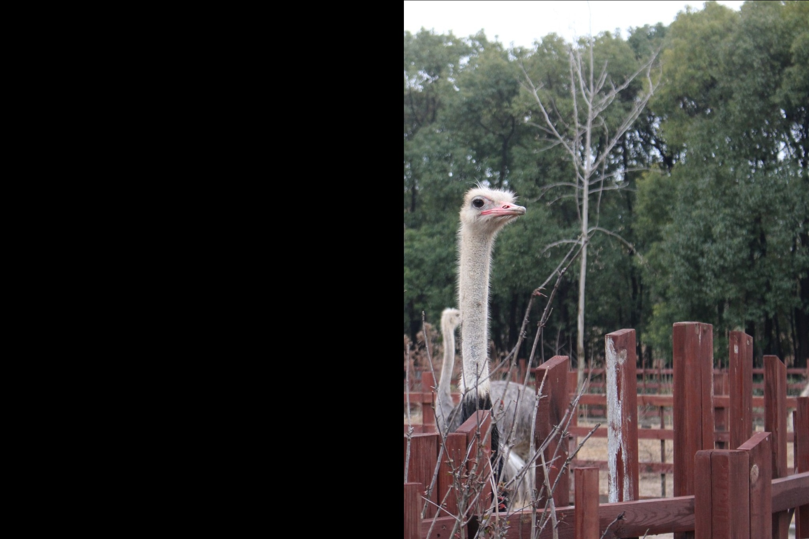

### 1 功能简介

图像拼接在实际的应用场景很广，该仓库基于OpenCV初步实现了基于SURF特征的图像拼接。用SIFT算法来实现图像拼接是很常用的方法，但是因为SIFT计算量很大，所以在速度要求很高的场合下不再适用。所以，它的改进方法SURF因为在速度方面有了明显的提高（速度是SIFT的3倍），所以在图像拼接领域还是大有作为。虽说SURF精确度和稳定性不及SIFT，但是其综合能力还是优越一些。

- 图像拼接步骤大致如下：
  - 对每幅图进行特征点提取
  - 对对特征点进行匹配
  - 进行图像配准
  - 把图像拷贝到另一幅图像的特定位置
  - 对重叠边界进行特殊处理

#### 1.1 效果如下

- 输入图像




- 特征点匹配



- 透视变换



- 初步拼接


- 优化缝隙


### 2 编译方式

- `build`目录下为已经编译好的`VS 2015 Release`工程文件，可根据实际情况重新编译。
- `Linux`，使用gcc：

```shell
cd build
cmake ..
make
```

- `Windows`，使用MSVC：

```shell
cd build
# 指定编译器版本
# 32位
# cmake -G "Visual Studio 14 2015" ..
make -G "Visual Studio 15 2017 " ..
# 64位
# cmake -G "Visual Studio 14 2015  Win64" ..
cmake -G "Visual Studio 15 2017  Win64" ..
```

```shell
Visual Studio 16 2019        = Generates Visual Studio 2019 project files.
                               Use -A option to specify architecture.
Visual Studio 15 2017 [arch] = Generates Visual Studio 2017 project files.
                               Optional [arch] can be "Win64" or "ARM".
Visual Studio 14 2015 [arch] = Generates Visual Studio 2015 project files.
                               Optional [arch] can be "Win64" or "ARM".
Visual Studio 12 2013 [arch] = Generates Visual Studio 2013 project files.
                               Optional [arch] can be "Win64" or "ARM".
Visual Studio 11 2012 [arch] = Generates Visual Studio 2012 project files.
                               Optional [arch] can be "Win64" or "ARM".
```

- `Windows`，使用MinGW64：

```shell
cd build
cmake -G"MinGW64 Makefiles" ..
mingw32-make
# 可将mingw32-make.exe重命名位make.exe
```

### 3 调用方式

- `ImageStitching.exe`在`bin/x64/Release`目录下，通过命令行调用方式如下：

```shell
./ImageStitching.exe ../../../resouce/test1.jpg ../../../VSCodeWorkSpace/ImageStitching/resouce/test2.jpg
```

- `image_stitching.dll`在`lib/x64/Release`目录下，调用API参考`lib/include`目录下的`image_stitching.h`。
- `libimage_stitching.lib`在`lib/x64/Release`目录下，调用API参考`lib/include`目录下的`image_stitching.h`。

